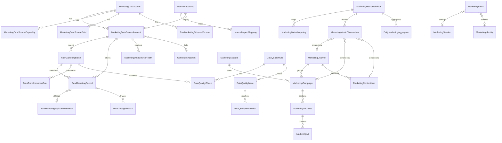

# Marketing Data Model

Entity relationships for the Task 3.1 warehouse schema (`prisma/schema.prisma`, migration `20260730100000_task_3_1_marketing_data_warehouse`).

## Tenant scoping

All brand-owned records include `organisationId`, `projectId`, and `brandId`. Global registry entries (`MarketingDataSource`, `DataTransformationVersion`) omit tenant keys.

## Entity relationship overview



## Source registry

| Model | Scope | Purpose |
| --- | --- | --- |
| `MarketingDataSource` | Global | Provider catalogue (`GA4`, `GOOGLE_ADS`, `MANUAL_IMPORT`, `SOCIAL_BRIDGE`, etc.) |
| `MarketingDataSourceAccount` | Brand | Connected source account; optional `connectorAccountId` |
| `MarketingDataSourceCapability` | Global | Enabled capabilities per source (`METRICS`, `EVENTS`, `COST`, …) |
| `MarketingDataSourceField` | Global | Field catalogue for import mapping and validation |
| `MarketingDataSourceHealth` | Brand | Point-in-time health snapshot per account |
| `RawMarketingSchemaVersion` | Global | Versioned raw payload schema per source |

### Provider enum

`MarketingDataProvider` values: `GA4`, `GOOGLE_SEARCH_CONSOLE`, `GOOGLE_ADS`, `META`, `INSTAGRAM`, `LINKEDIN`, `TIKTOK`, `YOUTUBE`, `X`, `STRIPE`, `EMAIL_PROVIDER`, `CRM_PROVIDER`, `FIRST_PARTY`, `MANUAL_IMPORT`, `SOCIAL_BRIDGE`.

In 3.1, only `MANUAL_IMPORT`, `FIRST_PARTY`, `SOCIAL_BRIDGE`, and test stubs are active ingest paths.

## Raw ingestion

| Model | Purpose |
| --- | --- |
| `RawMarketingBatch` | Durable ingest job with lease, cursor, and retry state |
| `RawMarketingRecord` | Immutable provider payload with idempotency key |
| `RawMarketingPayloadReference` | Object-storage pointer for large payloads |

Unique constraints prevent duplicate ingest:

- Batch: `idempotencyKey`
- Record: `[marketingDataSourceAccountId, providerRecordId, recordType]`
- Record idempotency: `idempotencyKey`

## Dimensions

Advertising and content hierarchy:

```
MarketingChannel
  └── MarketingCampaign
        └── MarketingAdGroup
              └── MarketingAd

MarketingContentItem  (linked to MarketingChannel)
MarketingAudience
MarketingAccount      (parallel to channel; used for paid accounts)
```

`MarketingCampaign` in the warehouse is a **marketing dimension** — distinct from future `ContentCampaign` (Stage 2 content operations).

`MarketingChannel` (Prisma model) maps to the `WarehouseMarketingChannel` database table to avoid clashing with the onboarding `MarketingChannel` enum type from Stage 1.

Channel classification:

| Model | Purpose |
| --- | --- |
| `MarketingChannelRule` | Brand-scoped pattern rules for channel assignment |
| `MarketingChannelClassification` | Applied classification with optional confidence |

See `docs/CHANNEL_TAXONOMY.md`.

## Metrics

| Model | Purpose |
| --- | --- |
| `MarketingMetricDefinition` | Canonical metric (`canonicalKey`, unit, aggregation) |
| `MarketingMetricMapping` | Provider field → canonical metric |
| `MarketingMetricObservation` | Time-series fact (cross-source canonical table) |
| `MarketingMetricCorrection` | Operator correction overlay |
| `DailyMarketingAggregate` | Pre-computed daily rollups |

`MarketingMetricSource` on observations: `CONNECTOR`, `SOCIAL`, `MANUAL_IMPORT`, `FIRST_PARTY`, `DERIVED`, `CORRECTION`.

## Events and identity

| Model | Purpose |
| --- | --- |
| `MarketingEvent` | Named event with properties |
| `MarketingEventProperty` | Key-value event attributes |
| `MarketingSession` | Session with UTM and device context |
| `MarketingIdentity` | Typed identity (`EMAIL`, `USER_ID`, `COOKIE_ID`, …) |
| `MarketingIdentityLink` | Identity graph edge with confirmation workflow |
| `MarketingConversionDefinition` | Goal/transaction/lead definitions |

See `docs/MARKETING_EVENTS.md`.

## Revenue and cost

| Model | Purpose |
| --- | --- |
| `MarketingRevenueRecord` | Recognised revenue with currency |
| `MarketingCostRecord` | Spend over a period, linked to campaign hierarchy |

## Currency

| Model | Purpose |
| --- | --- |
| `CurrencyRate` | Daily FX rate (manual in 3.1) |
| `CurrencyConversionRecord` | Audit trail of applied conversions |

See `docs/CURRENCY_GOVERNANCE.md`.

## Lineage and transformation

| Model | Purpose |
| --- | --- |
| `DataLineageRecord` | Entity provenance graph |
| `DataTransformationVersion` | Named transformation definition |
| `DataTransformationRun` | Per-batch transformation execution |

See `docs/DATA_LINEAGE.md`.

## Data quality

| Model | Purpose |
| --- | --- |
| `DataQualityRule` | Brand-scoped validation rule |
| `DataQualityCheck` | Rule execution result (optionally per batch) |
| `DataQualityIssue` | Detected anomaly |
| `DataQualityResolution` | Operator resolution action |

See `docs/DATA_QUALITY.md`.

## Manual import

| Model | Purpose |
| --- | --- |
| `ManualImportJob` | Upload lifecycle (`DRAFT` → `COMPLETED`) |
| `ManualImportMapping` | Column → target field mapping |

See `docs/MANUAL_IMPORT.md`.

## Aggregates

| Model | Purpose |
| --- | --- |
| `DailyMarketingAggregate` | Daily metric rollup by optional dimension |
| `AggregateRefreshRun` | Batch aggregate recomputation job |

## Parallel Stage 2 models (not merged)

These models remain separate. The warehouse reads from them via the social bridge but does not replace them:

| Stage 2 model | Warehouse equivalent |
| --- | --- |
| `SocialPostMetric` | Source for `SOCIAL_BRIDGE` → `MarketingMetricObservation` |
| `SocialAccountMetric` | Source for `SOCIAL_BRIDGE` → `MarketingMetricObservation` |
| `SocialMetricDefinition` | Parallel to `MarketingMetricDefinition` |
| `SocialAnalyticsSync` | Parallel to `RawMarketingBatch` |
| `ConnectorSync` | Parallel to `RawMarketingBatch` (connector path) |

## Deferred dimensions (Task 3.2 extension)

The following task-spec dimensions are **not** separate tables in 3.1 but can be added without breaking existing observations:

| Planned dimension | Extension strategy |
| --- | --- |
| `MarketingLandingPage` | New table + nullable `marketingLandingPageId` on `MarketingMetricObservation` / `MarketingEvent` |
| `MarketingDevice` | New table + nullable `marketingDeviceId` FK |
| `MarketingGeography` | New table + nullable `marketingGeographyId` FK |
| `MarketingReferrer` | New table or normalised `dimensions` JSON keys |
| `MarketingSearchQuery` | New table linked to SEO provider accounts |
| `MarketingCustomer` | New table; links to `MarketingIdentity` |
| `MarketingLeadDimension` | New table; bridges to `MarketingLead` |

Existing `dimensions` JSON on observations and `properties` on events preserve provider-specific attributes until dedicated dimension tables ship. Migrations are additive — no observation rows need rewriting.

## Indexing strategy

Initial indexes favour tenant + time range queries:

- `[organisationId, brandId, observedAt]` on observations
- `[organisationId, brandId, aggregateDate]` on daily aggregates
- `[marketingDataSourceAccountId, status]` on batches
- `[status, leaseExpiresAt]` and `[status, nextRetryAt]` for worker polling

JSON columns (`dimensions`, `properties`, `inlinePayload`) are not indexed by JSON path in 3.1.
